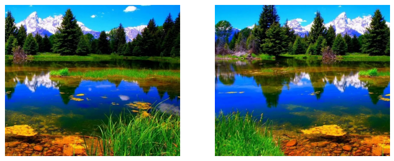
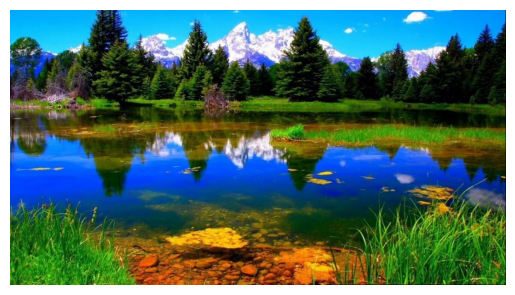

# Panorama Image Stitching

  
  

This is a project that takes 2 images and stitches them together to create a panorama image. Because this is a panorama image, the 2 provided images can contain overlapping portions of the same view and the code is responsible for determining what portion of the image is an overlap. The entire process consists of the following steps:

* Reading input images
* Detecting keypoints in each of the images
* Matching features between both images to determine overlap
* Estimating a homography matrix for the warp
* Blending the images using the information gathered in the steps above

Please refer to the following link to view the Jupyter notebook: [https://kchinna.github.io/SP500-Stock-Price-Analysis/](https://kchinna.github.io/panorama-stitching/). Within this notebook is my code, outputs of each step, and comments describing in detail what each step does.
